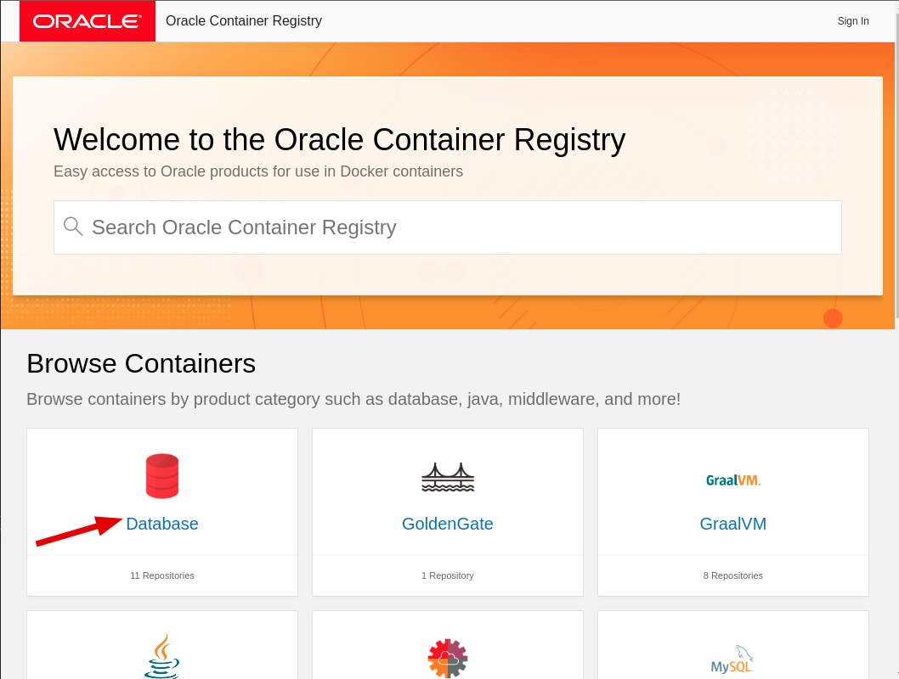
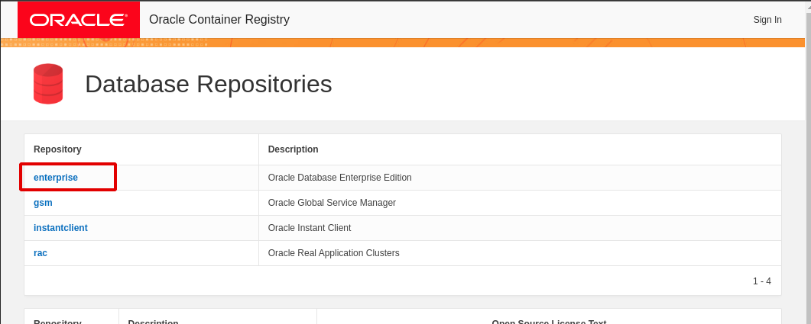
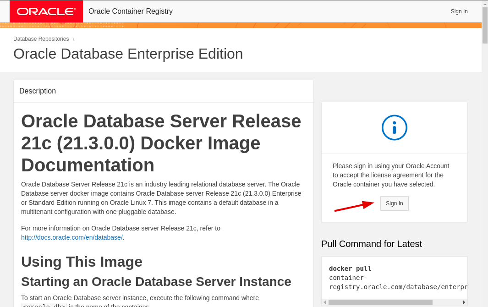

1. Register an account [Oracle | Create Account](https://profile.oracle.com/myprofile/account/create-account.jspx)
    
2. Go to [Home](https://container-registry.oracle.com/)
    
    1. Select Database
        
        
        
    2. select enterprise Repository
        
        
        
    3. sign in and accept EULA
        
        
        
3. Login with docker
    
    ```
    docker login container-registry.oracle.com
    ```
    
4. Pull image
    
    ```
    docker pull container-registry.oracle.com/database/enterprise:21.3.0.0
    ```
    
5. Run container
    
    ```
    docker run -d --name testdb -p 1521:1521 -e ORACLE_PWD=testpass -e ORACLE_SID=testdb container-registry.oracle.com/database/enterprise:21.3.0.0
    ```
    
6. Monitor installation
    
    ```
    docker logs -f testdb
    ```
    
    When you see this in the log, that means the container is ready to use
    
    ```
    DONE: Executing user defined scripts The Oracle base remains unchanged with value /opt/oracle ######################### DATABASE IS READY TO USE! ######################### The following output is now a tail of the alert.log: ORCLPDB1(3): ORCLPDB1(3):XDB initialized. 2023-05-26T10:11:56.147085+00:00 ALTER SYSTEM SET control_files='/opt/oracle/oradata/TEST/control01.ctl' SCOPE=SPFILE; 2023-05-26T10:11:56.155974+00:00 ALTER SYSTEM SET local_listener='' SCOPE=BOTH; ALTER PLUGGABLE DATABASE ORCLPDB1 SAVE STATE Completed: ALTER PLUGGABLE DATABASE ORCLPDB1 SAVE STATE XDB initialized.
    ```
    
7. Enter the container
    
    ```
    docker exec -it testdb bash -c "source /home/oracle/.bashrc; sqlplus /nolog"
    ```
    
8. Create user
    
    1. log in as sysdba
        
        ```
        connect sys as sysdba;
        ```
        
        password: Oradoc_bd1
        
    2. Create user test
        
        ```
        alter session set "_ORACLE_SCRIPT"=true; 
        create user test identified by test; 
        GRANT ALL PRIVILEGES TO test;
        ```
        
9. Configure Oracle for XA
    
    ```
    grant execute on dbms_xa to test; 
    grant select on pending_trans$ to test; 
    grant select on dba_2pc_pending to test; 
    grant select on dba_pending_transactions to test;
    ```
    
10. Obtain container IP
        
        `docker inspect -f '{{range .NetworkSettings.Networks}}{{.IPAddress}}{{end}}' testdb`